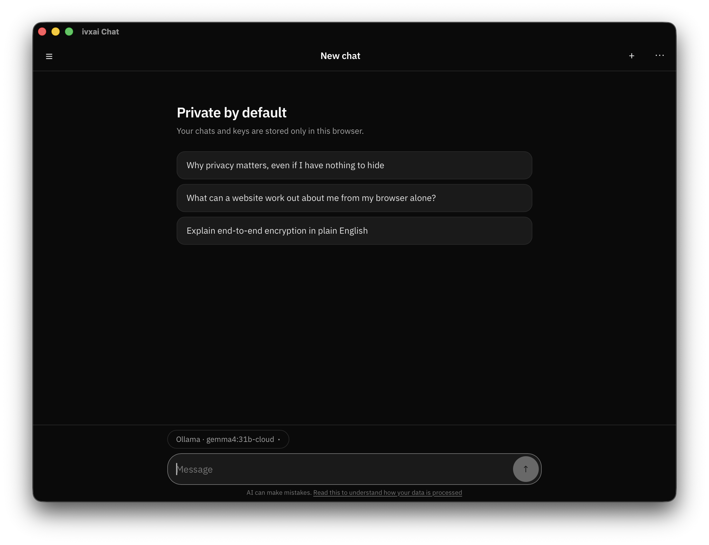

# ivx/ai Chat

The desktop app, and the standalone CORS bridge it is built around.

<p align="center">
  
</p>

[ivx/ai Chat](https://github.com/ivxlabs/chat) runs entirely in a browser and
talks straight to whatever endpoint you point it at — right up until the
endpoint sends no CORS headers. Ollama on its defaults, a bare llama.cpp build,
a private proxy someone set up years ago: those servers are fine, the browser
simply will not let a web page speak to them.

This repository solves that twice:

- **`ivx-bridge`** — a 2 MB daemon. Leave it running and the hosted app reaches
  every endpoint on your machine. Nothing to install, nothing to keep updated.
- **The app** — the same UI in a native window, with the same bridge running
  inside it. Nothing to configure.

## Install

macOS:

```sh
brew tap ivxlabs/tap
brew trust ivxlabs/tap              # once: see below
brew install --cask ivxai-chat      # the app
brew install ivx-bridge             # or just the bridge
```

Homebrew refuses to load formulae and casks from a tap you have not trusted,
because a tap is arbitrary Ruby that runs on your machine. `brew trust` records
the decision in `~/.homebrew/trust.json` and you only make it once. Trust
individual packages instead with `brew trust --cask ivxlabs/tap/ivxai-chat`.

Windows and Linux: take the installer from
[Releases](https://github.com/ivxlabs/ivxai-app/releases).

| Platform | App | Bridge |
| --- | --- | --- |
| macOS | `.dmg` or `.app.tar.gz`, universal | `.tar.gz`, universal |
| Windows | `-setup.exe` | `.tar.gz` |
| Linux | `.AppImage` or `.deb` | `.tar.gz` |

Nothing is notarised or signed with a paid certificate, so Gatekeeper and
SmartScreen both object on first launch. The release notes say how to get past
it.

## The bridge

```sh
ivx-bridge
```

```
ivx-bridge 0.1.1 on http://127.0.0.1:8787
  accepting: http://localhost:*, https://o.eval.blog, …
  connect:   ivx/ai Chat -> Settings -> CORS bypass -> Look for the bridge
```

Then in the app: **Settings → CORS bypass → Look for the bridge**. Once it
answers, provider calls go through it, and the switch turns it off again at any
time. `ivx-bridge --install-service` keeps it running across reboots (launchd on
macOS, systemd `--user` on Linux); on Homebrew, `brew services start ivx-bridge`
does the same.

One route: `POST /proxy?url=<absolute URL>` forwards the request and streams the
answer back with the CORS headers a browser needs.

- **Nothing is inspected.** It does not know what a chat completion is and never
  parses a body. Responses are piped through frame by frame, so a streamed
  completion still arrives token by token.
- **Nothing is kept.** No disk, no cache, no request log. `-v` prints one line
  per request — method, host, status — and never headers or bodies.
- **Browser-specific headers are dropped** before the request goes out:
  `Origin`, `Referer`, `Cookie`, `Accept-Encoding`. Several providers reject a
  request that claims to come from a page they do not recognise.

### Who is allowed to use it

A daemon that forwards to any URL is useful to any page in your browser, not
just this one, so the origin allowlist is the whole security boundary. It holds
because the browser sets `Origin` itself and a page cannot forge it — a site you
happen to visit cannot borrow the bridge to reach your router's admin page.

Allowed by default: `https://ai.ivx.run`, `https://o.eval.blog`,
`https://ivxlabs.github.io`, any loopback origin on any port, and the Tauri
webview origins. Everything else gets a 403 naming the flag you would need.

A request with **no** `Origin` is allowed: those come from non-browser clients,
which could already reach the same endpoints directly. On a shared machine, use
`--token <secret>` — the app has a field for it.

### Options

```
-p, --port <port>        Port to listen on (default 8787)
    --host <addr>        Address to bind (default 127.0.0.1)
    --allow-origin <o>   Also accept this browser origin (repeatable)
    --only-origin <o>    Accept only the origins given this way (repeatable)
    --allow-any-origin   Accept every origin. Development only
    --token <secret>     Require this token on /proxy
    --ui-dir <dir>       Also serve a built copy of ivx/ai Chat from here
    --insecure           Do not verify TLS upstream. Local self-signed only
    --connect-timeout <s>  Seconds to wait for a connection (default 30)
-v, --verbose            One line per request
    --install-service    Install and start a login service
    --uninstall-service  Stop and remove it
```

### Safari

Chrome and Firefox treat `http://127.0.0.1` as trustworthy, so an HTTPS page may
call it. Safari does not, and blocks it as mixed content. The way out is to stop
being cross-origin: `ivx-bridge --ui-dir web/dist` serves the app itself, so the
page and the bridge share an origin and there is nothing left to block.

## Building it

```sh
git clone --recurse-submodules https://github.com/ivxlabs/ivxai-app
cd ivxai-app
npm install
```

| What | Command | Needs |
| --- | --- | --- |
| The bridge alone | `cargo build --release -p ivx-bridge` | Rust |
| The app | `npm run build` | Rust, Node, [Tauri prerequisites](https://tauri.app/start/prerequisites/) |
| The app, running | `npm run dev` | same |

The UI is not in this repository: `web/` is a submodule pointing at
[ivxlabs/chat](https://github.com/ivxlabs/chat), so the web app stays a web app
and this repository stays about shipping it.

```
web/                  submodule: ivx/ai Chat, unchanged
crates/ivx-bridge/    the CORS bridge — library and daemon
src-tauri/            the Tauri shell, which embeds that library
```

## How the app carries the bridge

The app starts its own copy of the bridge in-process, on an ephemeral loopback
port behind a random token, and hands the page the address through a webview
initialization script:

```js
window.__IVX_BRIDGE__ = { url: "http://127.0.0.1:50823", token: "…", source: "app" }
```

The UI picks that up and shows **Settings → CORS bypass** as "Built into this
app". Reusing the bridge this way means the hosted build and the app make the
same `fetch` to the same kind of endpoint — one implementation to get right, and
`web/` never has to care where it is running.

## Releasing

Bump the version with `npm run bump patch` (or `minor`, `major`, or an exact
`0.2.0`), commit it, and tag that commit `vX.Y.Z`. `release.yml` builds the app and the
bridge for all three platforms onto one **draft** release; check the artefacts
and publish it. Publishing updates the [Homebrew
tap](https://github.com/ivxlabs/homebrew-tap) automatically.

## Contributing

Development notes, the mobile builds and the release internals are in
[CONTRIBUTING.md](CONTRIBUTING.md).

## Supporting it

No ads, no trackers, no accounts, no paid tier. If it is useful to you:

- [Sponsor the project](https://github.com/sponsors/0xcrypto)
- [Star it on GitHub](https://github.com/ivxlabs/chat) — it is how other people find it
- [Recommend it on AlternativeTo](https://alternativeto.net/software/ivx-ai-chat/about/?utm_source=badge&utm_medium=referral)

<p align="center">
  <a href="https://alternativeto.net/software/ivx-ai-chat/about/?utm_source=badge&utm_medium=referral" target="_blank">
    
  </a>
</p>

## Licence

GPL-3.0-or-later, the same as the web app — see [LICENSE](LICENSE). You may use,
study, share and modify it; a distributed modification has to carry the same
licence with its source available.
